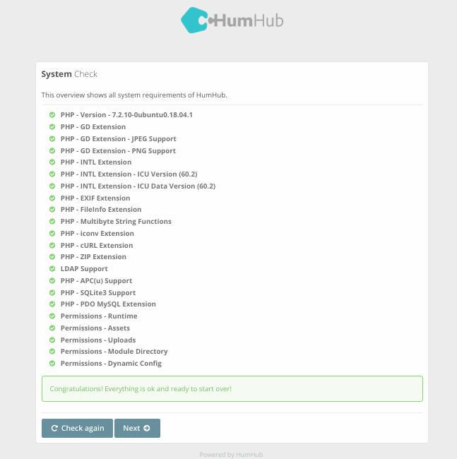
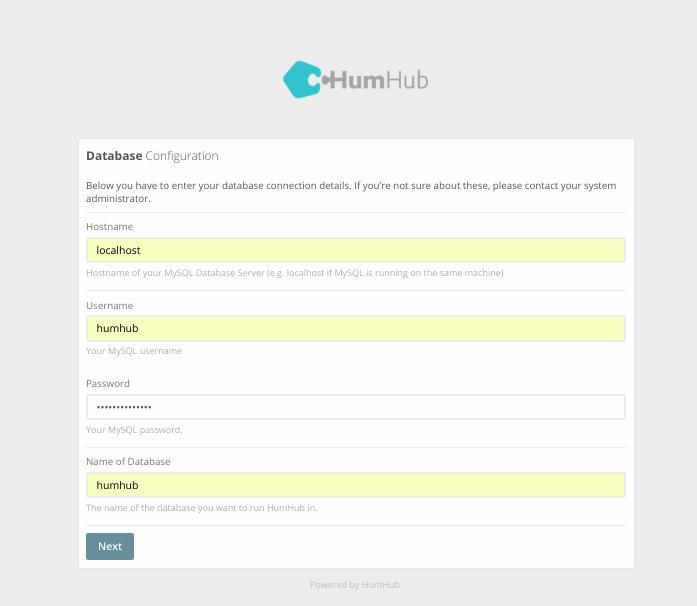
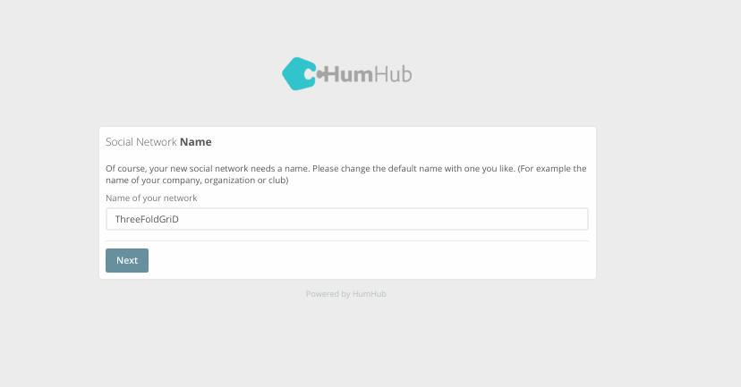
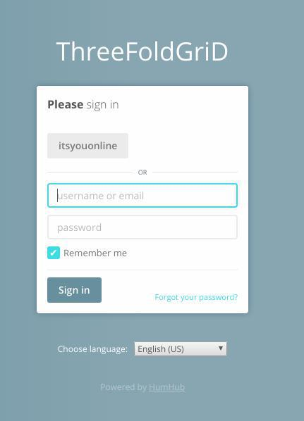

## Installation

#### Automatic / Threefold Token Grid

- Follow instructions on [Freeflow-flit](https://github.com/freeflowpages/freeflow-flist)

#### Manual

- **Build a new Release** from [FreeFlow-Server](https://github.com/freeflowpages/freeflow-server)
    - git clone https://github.com/freeflowpages/freeflow-server
    - cd freeflow-server
    - download [release-builder.sh](https://github.com/freeflowpages/freeflow-flist/blob/master/release-builder.sh) from [Freeflow-flit](https://github.com/freeflowpages/freeflow-flist)
    - Add execution permissions `chmod u+x release-builder.sh`
    - Run `./release-builder.sh`
    
- **Install and configure mysql-server**
    - Install `apt install mysql-server`
    - Configuration [Replace db_name and db_password with actual values] 
        - Run ```mysql -u root -e CREATE DATABASE `humhub` CHARACTER SET utf8mb4 COLLATE utf8mb4_unicode_ci;GRANT ALL ON `humhub`.* TO `humhub`@localhost IDENTIFIED BY 'db_password;FLUSH PRIVILEGES;```

- Move release directory to `/var/www/html` and rename to `humhub`
    - `mv freeflow-server /var/www/html/humhub`

- chown -R ww-data:www-data /var/www/html/humhub

- **Configure**
    - Download `Freeflow` [Config file](https://github.com/freeflowpages/freeflow-flist/blob/master/common.php) `common.php` and add it to `/var/www/html/humhub/protected/config`
    - Copy [Itsyou.online support module](https://github.com/freeflowpages/freeflow-iyo-module/blob/master/IYO.php) to {Humhub_DIR}/protected/humhub/modules/user/authclient/IYO.php

- **Run web Installer** to create tables in the `humhub` database and follow instructions in [web Installer section](https://github.com/freeflowpages/home/blob/master/Install.md#migrating-db-only-if-youre-installing-new-version-of-humhub-against-a-database-of-older-version) below

## Migrating DB from old version to new one
   - Run command `php /var/www/html/humhub/protected/yii migrate/up`

## Install [freeflow-rest-api](https://github.com/freeflowpages/freeflow-rest-api-module) module (Folow instructions there)

## Web Installer
 

    
- Enter DB configurations you used above


    
- Choose a name for the new social network
  

    
- Create a new Admin account for humhub which will have administrator privileges

 




